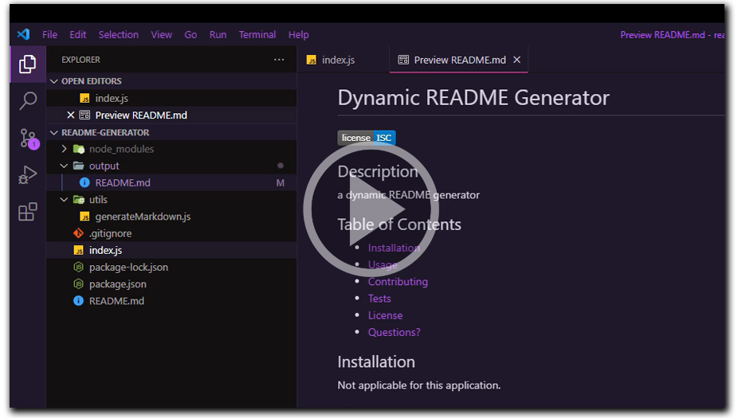

# Dynamic README Generator

## Description
This CLI application allows any user to quickly and dynamically create a richly detailed and interactive README file for each new application.

## Table of Contents
- [Installation](#installation)
- [Usage](#usage)
- [Contributing](#contributing)
- [Tests](#tests)
- [License](#license)
- [Questions?](#questions)

## Installation
1. Clone the repo down.
2. Run "npm i" from the terminal.

## Usage
Simply run "node index.js" in your terminal, and answer all the questions. Your new README file will be created in the "output" folder.

You can watch and follow the video tutorial below.

## Contributing
Not applicable for this application.

## Tests
Not applicable for this application.

## License
This application has been created under the ISC open source license.
      Follow the link below to learn more.
      
[ISC license information](https://opensource.org/licenses/ISC)

## Questions?
To submit any issues or security concerns about this application, please visit https://github.com/helovedus1st/readme-generator.

Contact me directly via email at [jc-renner@lu-tec.com](mailto:jc-renner@lu-tec.com?subject=readme-generator).
